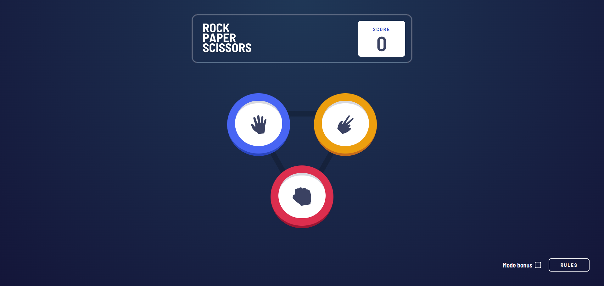
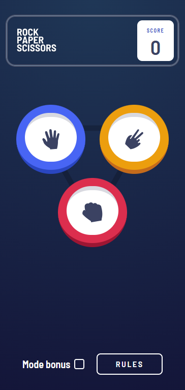
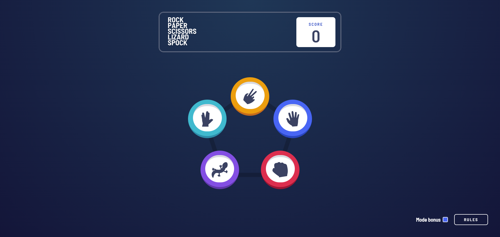
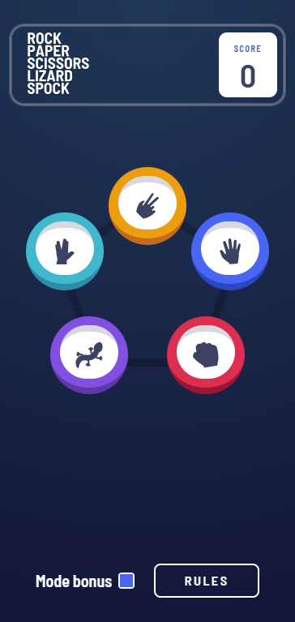

# Frontend Mentor - Rock, Paper, Scissors solution

This is a solution to the [Rock, Paper, Scissors challenge on Frontend Mentor](https://www.frontendmentor.io/challenges/rock-paper-scissors-game-pTgwgvgH). Frontend Mentor challenges help you improve your coding skills by building realistic projects.

## Table of contents

- [Overview](#overview)
  - [The challenge](#the-challenge)
  - [Screenshot](#screenshot)
  - [Links](#links)
- [My process](#my-process)
  - [Built with](#built-with)
  - [What I learned](#what-i-learned)
  - [Continued development](#continued-development)
  - [Useful resources](#useful-resources)
- [Author](#author)
- [Acknowledgments](#acknowledgments)

## Overview

### The challenge

Users should be able to:

- View the optimal layout for the game depending on their device's screen size
- Play Rock, Paper, Scissors against the computer
- Maintain the state of the score after refreshing the browser ✓
- **Bonus**: Play Rock, Paper, Scissors, Lizard, Spock against the computer ✓

### Screenshots

### Links

- Solution URL: [https://github.com/Mooenz/rock-paper-scissors](https://github.com/Mooenz/rock-paper-scissors)
- Live Site URL: [https://mooenz.github.io/rock-paper-scissors/](https://mooenz.github.io/rock-paper-scissors/)

## My process

### Built with

- Semantic HTML5 markup
- CSS custom properties (Tailwind CSS)
- Flexbox
- CSS Grid
- Mobile-first workflow
- [React](https://reactjs.org/) - JS library
- [TypeScript](https://www.typescriptlang.org/) - For type safety
- [Tailwind CSS](https://tailwindcss.com/) - For styling
- [Vite](https://vitejs.dev/) - Build tool
- [Zustand](https://github.com/pmndrs/zustand) - State management

### What I learned

During this project, I learned how to effectively use Zustand for state management in a React application. I also improved my skills in TypeScript by ensuring type safety throughout the codebase. Additionally, I gained experience in implementing responsive designs using Tailwind CSS and handling game logic for Rock, Paper, Scissors, Lizard, Spock.

## Author

- [Frontend Mentor](https://www.frontendmentor.io/profile/Mooenz)
- [GitHub - @mooenz](https://github.com/Mooenz)
- [LinkedIn - @mooenz](https://linkedin.com/in/mooenz)
- [Sitio web](https://twitter.com/mooenz)

